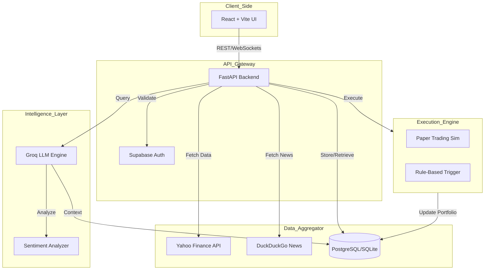

# 🚀 Copilot_Money - AI-Powered Trading Psychology Platform

<div align="center">


<h3>Transform financial chaos into crystal-clear investment decisions.</h3>

<p align="center">
  <a href="https://youtu.be/6yqmeYyEJxU">View Demo</a> •
  <a href="#-the-problem">The Problem</a> •
  <a href="#-features">Key Features</a> •
  <a href="#-architecture">Architecture</a> •
  <a href="#-quick-start">Run Locally</a>
</p>

</div>

---

## 📉 The Problem: The Paradox of Choice

Every day, millions of Indian retail investors face a paradox. They have access to more information than ever before—broker tips, flashy news headlines, and constant app alerts. Yet, this **Information Overload** leaves them confused, not confident.

The advice is scattered, often contradictory, and impossible for a busy professional to vet. This pushes investors into two dangerous traps:

1.  **The Analysis Paralysis Trap:** Fear of making a misstep leads to inaction, watching great opportunities pass by.
2.  **The FOMO Trap:** Hype-driven, emotional decisions that often lead to painful financial losses.

> **The missing piece isn't more data. It's a trusted, intelligent guide.**

---

## 💎 The Solution: Copilot_Money

**Copilot_Money** is an intelligent "Source of Truth" designed to cut through the noise. We built a 3-step engine to turn chaos into actionable wealth creation:

1.  **Gather Intelligence:** We aggregate data from trusted brokers, financial analysts, and real-time market news sources.
2.  **Find the Signal (AI):** Our **Groq-powered LLM** stress-tests ideas, compares conflicting viewpoints, and performs sentiment analysis to find high-conviction opportunities.
3.  **Actionable Guidance:** We translate complex analysis into simple "Buy, Sell, or Hold" signals. For immediate action, our system offers **Paper Trading** to test strategies risk-free and **Automated Rules** to manage exits.

---

## ✨ Key Features

### 🧠 AI Trading Assistant
- **Context-Aware Chat:** Powered by Groq's LLM for natural language queries (e.g., "Analyze my last 20 trades and identify my biases").
- **Smart Recommendations:** Context-aware stock suggestions based on real-time market conditions.
- **Sentiment Analysis:** AI-driven scoring of news articles to gauge market mood.

### 📊 Paper Trading Platform
- **Risk-Free Simulation:** Test strategies with virtual money using real-time market data via Yahoo Finance.
- **Portfolio Tracking:** Real-time P&L tracking, valuation updates, and transaction history.
- **Bulk Execution:** Execute multiple simulated trades simultaneously.

### ⚡ Automated Trading Engine
- **Set & Forget Rules:** Define logic like "Sell AAPL if price drops below $150."
- **Background Monitoring:** Our engine monitors active rules every 10 seconds.
- **Auto-Execution:** Automatically executes trades when conditions are met to protect capital.

### 🛡 Security & Compliance
- **SEBI Aligned:** Built with regulatory boundaries in mind; clearly distinguishes between AI analysis and financial advice.
- **Secure Auth:** Supabase-powered authentication with Google OAuth.
- **Data Privacy:** Strict user data isolation.

---

## 🏗 High-Level Architecture

We utilized a modular, event-driven architecture to handle real-time market data and AI processing efficiently.



# 🔄 User Workflow
       
sequenceDiagram
    participant User
    participant App
    participant AI_Brain
    participant Market_Data
    
    User->>App: "Should I buy AAPL right now?"
    App->>Market_Data: Fetch Live Price & News
    Market_Data-->>App: Price: $150, Sentiment: Bullish
    App->>AI_Brain: Analyze Context + User Portfolio
    AI_Brain-->>App: "Buy signal detected. Strong fundamentals."
    App->>User: Displays Analysis & "One-Click Buy" Button
    User->>App: Clicks "Execute Paper Trade"
    App->>App: Updates Portfolio & Balance
    App-->>User: "Trade Executed Successfully!"


# Section 6: Tech Stack


## 🛠 Tech Stack

| Component | Technologies |
| :--- | :--- |
| **Frontend** | React 18, TypeScript, TailwindCSS, Shadcn/UI, Vite, TanStack Query |
| **Backend** | Python (FastAPI), Uvicorn, SQLModel, Alembic |
| **AI & ML** | **Groq API** (LLM), Pandas (Data Analysis), DuckDuckGo (News Aggregation) |
| **Data Sources** | Yahoo Finance (yfinance), SQLite (Dev) / PostgreSQL (Prod) |
| **DevOps** | Git, Supabase (Auth), Dotenv |

---


## 🚀 Quick Start

Follow these steps to set up the project locally.

### Prerequisites
- Node.js (v18+)
- Python (v3.10+)
- Groq API Key ([Get here](https://console.groq.com))

## 1. Backend Setup

```bash
# Navigate to backend
cd backend

# Create virtual environment
python -m venv venv
source venv/bin/activate  # Windows: .\venv\Scripts\activate

# Install dependencies
pip install -r requirements.txt

# Configure Environment
# Create a .env file and add:
# GROQ_API_KEY="your_api_key"
# DATABASE_URL="sqlite:///./data_v2.db"

# Run Server
python main.py
# Server runs at http://localhost:8000
```

## 2. Frontend Setup    
### Open new terminal and navigate to frontend
cd copilot-money-hub

### Install dependencies
npm install

### Run Development Server

npm run dev
### App runs at http://localhost:8080

### Section 8: Roadmap & Team

## 🔮 Roadmap & Vision

**Our Go-to-Market Strategy:**
1.  **Phase 1:** Launch Freemium Web Platform (Current).
2.  **Phase 2:** Partner with Brokerages (Zerodha/Upstox) for real execution APIs.
3.  **Phase 3:** Introduce white-label AI modules for Fintech partners.

**Future Features:**
- [ ] Mobile App (React Native)
- [ ] Social Trading (Copy top AI strategies)
- [ ] Advanced Technical Indicators
- [ ] AI will automatically adjust the entry and exit points using stock data, market news, and other relevant resources

---

## 👥 The Anonymous Squad

Built with ❤️ for **Mumbai Hacks**

---

